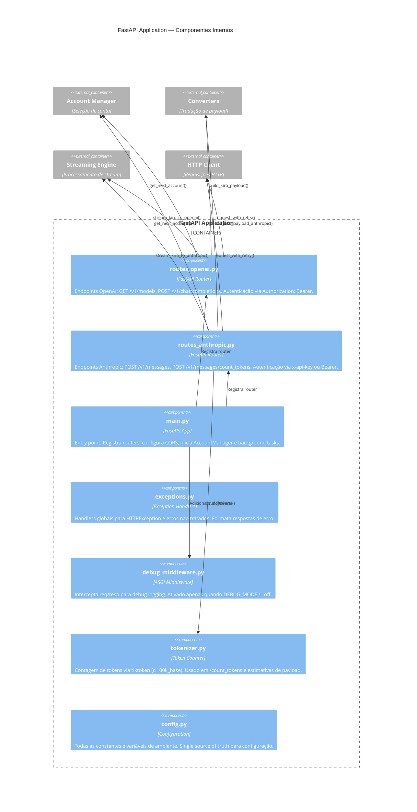
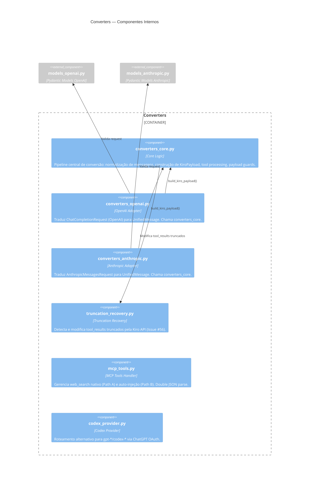
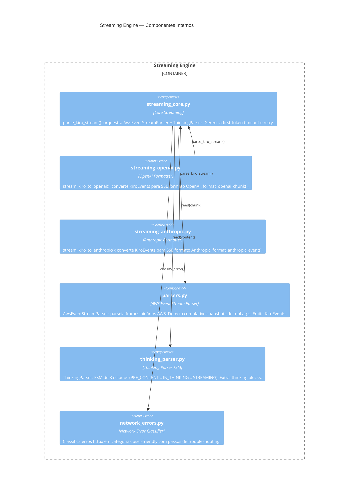
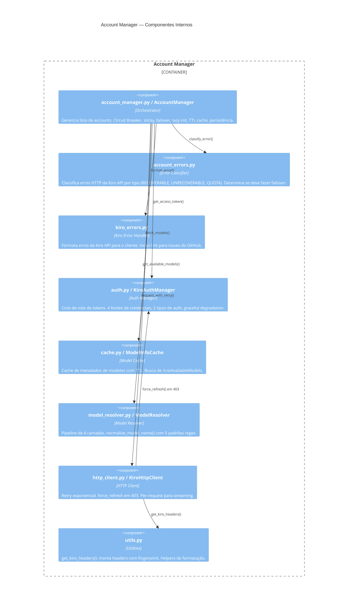

# C4 — Nível 3: Componentes

> Escala de confiança: 🟢 CONFIRMADO | 🟡 INFERIDO | 🔴 LACUNA

---

## Container: FastAPI Application

---

## Container: Converters

---

## Container: Streaming Engine

---

## Container: Account Manager

