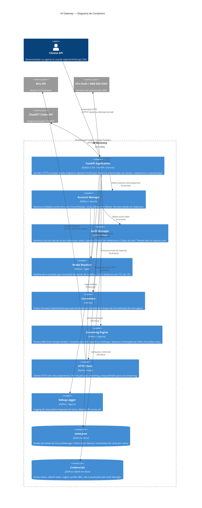

# C4 — Nível 2: Containers

> Escala de confiança: 🟢 CONFIRMADO | 🟡 INFERIDO | 🔴 LACUNA

---

## Descrição dos Containers

| Container | Tecnologia | Responsabilidade Principal |
|-----------|-----------|---------------------------|
| 🟢 FastAPI Application | Python / FastAPI / Uvicorn | Entry point HTTP, autenticação de clientes, roteamento por formato de API |
| 🟢 Account Manager | Python / asyncio | Seleção de conta com Circuit Breaker, sticky, failover, persistência de estado |
| 🟢 Auth Manager | Python / httpx | Ciclo de vida de tokens por conta, refresh automático, graceful degradation |
| 🟢 Model Resolver | Python / regex | Normalização e resolução de nomes de modelos, cache com TTL |
| 🟢 Converters | Python | Tradução OpenAI/Anthropic → KiroPayload, normalização de mensagens |
| 🟢 Streaming Engine | Python / asyncio | Parse AWS Event Stream, conversão SSE, ThinkingParser FSM |
| 🟢 HTTP Client | Python / httpx | Retry exponencial, per-request para streaming, force_refresh em 403 |
| 🟢 Debug Logger | Python / loguru | Logging opcional de req/resp completos em disco |
| 🟢 state.json | JSON em disco | Estado persistido do AccountManager entre reinicializações |
| 🟢 Credenciais | JSON ou SQLite | Tokens de autenticação Kiro, lidos e atualizados pelo Auth Manager |
