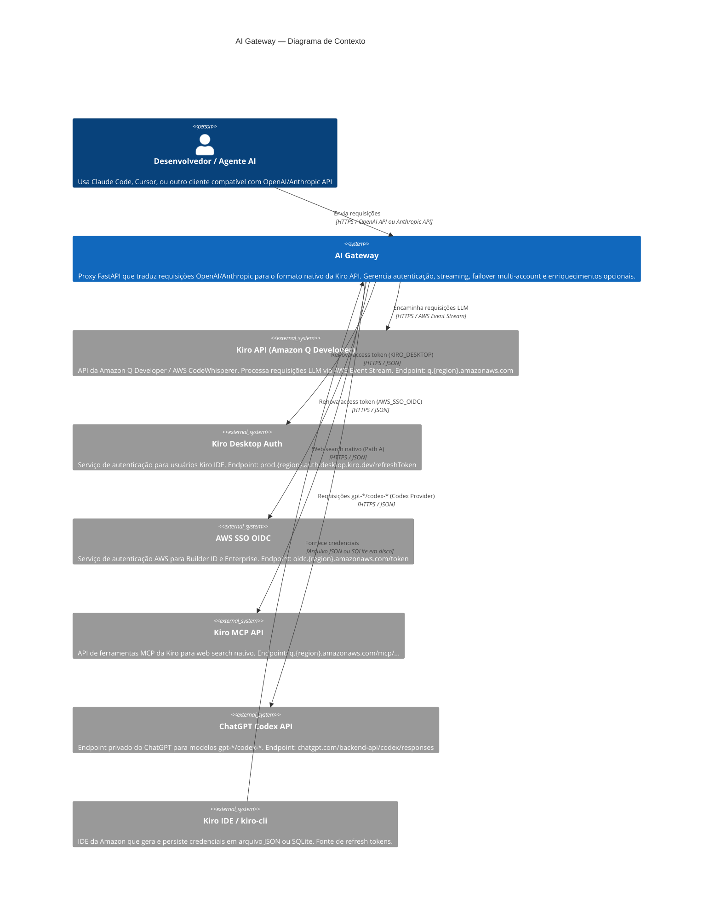

# C4 — Nível 1: Contexto do Sistema

> Escala de confiança: 🟢 CONFIRMADO | 🟡 INFERIDO | 🔴 LACUNA

---

## Atores e Sistemas Externos

### Usuários (Personas)

| Persona | Descrição | Interface |
|---------|-----------|-----------|
| 🟢 Desenvolvedor com Claude Code | Usa Claude Code CLI apontado para o gateway | OpenAI API (`/v1/chat/completions`) |
| 🟢 Desenvolvedor com cliente Anthropic | Usa SDK Anthropic ou Cursor apontado para o gateway | Anthropic API (`/v1/messages`) |
| 🟡 Operador do Gateway | Configura e mantém o gateway em produção | `.env`, Docker, CLI |

### Sistemas Externos

| Sistema | Protocolo | Direção | Propósito |
|---------|-----------|---------|-----------|
| 🟢 Kiro API (Amazon Q) | HTTPS + AWS Event Stream | Gateway → Kiro | Processamento LLM |
| 🟢 Kiro Desktop Auth | HTTPS/JSON | Gateway → Auth | Refresh de token (KIRO_DESKTOP) |
| 🟢 AWS SSO OIDC | HTTPS/JSON | Gateway → AWS | Refresh de token (Builder ID / Enterprise) |
| 🟢 Kiro MCP API | HTTPS/JSON | Gateway → MCP | Web search nativo (Path A) |
| 🟢 ChatGPT Codex API | HTTPS/JSON | Gateway → ChatGPT | Modelos gpt-*/codex-* |
| 🟢 Kiro IDE / kiro-cli | Arquivo em disco | IDE → Gateway | Fonte de credenciais (JSON ou SQLite) |
