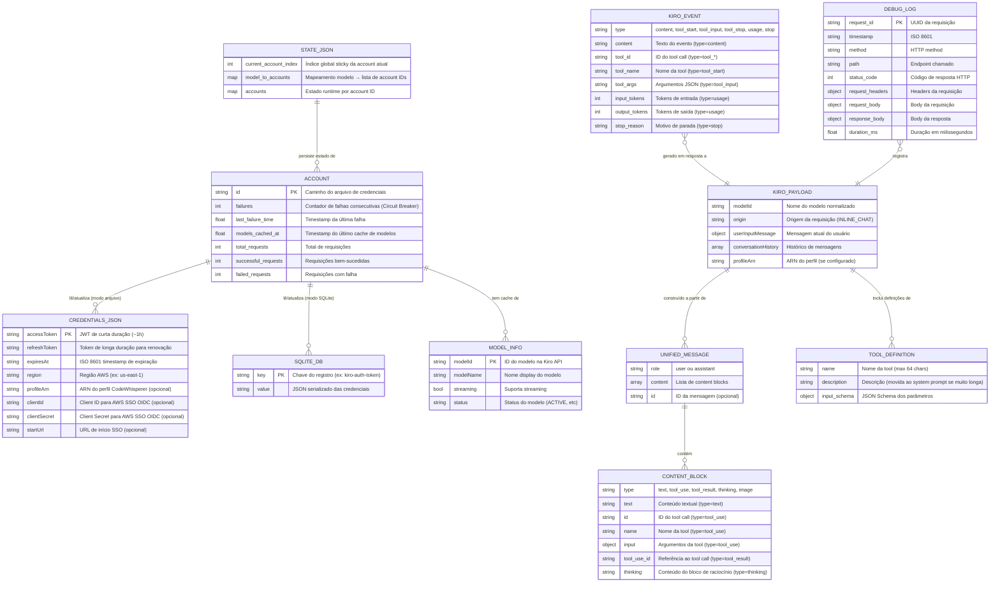

# ERD Completo — Open AI Gateway

> Escala de confiança: 🟢 CONFIRMADO | 🟡 INFERIDO | 🔴 LACUNA

---

## Diagrama ERD

---

## Descrição das Entidades

### ACCOUNT
🟢 Entidade runtime gerenciada pelo `AccountManager`. Não persiste em banco — estado salvo em `state.json`. Cada account corresponde a um arquivo de credenciais Kiro.

### CREDENTIALS_JSON
🟢 Arquivo JSON em disco com credenciais Kiro. Lido pelo `KiroAuthManager`. Atualizado após cada refresh de token. Localização configurável via `KIRO_CREDS_FILE`.

### SQLITE_DB
🟢 Banco SQLite do kiro-cli (`~/.local/share/kiro-cli/data.sqlite3`). Tabela com pares chave-valor onde o valor é JSON serializado das credenciais. Estratégia Read-Merge-Write para evitar race conditions.

### STATE_JSON
🟢 Arquivo `state.json` persistido pelo `AccountManager`. Contém índice global sticky, mapeamento modelo→accounts e estado de Circuit Breaker por account. Salvo atomicamente via arquivo temporário + rename.

### KIRO_PAYLOAD
🟢 Estrutura enviada para `generateAssistantResponse`. Formato proprietário da Kiro API. Construído pelos converters a partir de UnifiedMessages.

### UNIFIED_MESSAGE
🟢 Formato interno intermediário. Normaliza diferenças entre OpenAI e Anthropic antes de construir o KiroPayload.

### CONTENT_BLOCK
🟢 Unidade atômica de conteúdo dentro de uma mensagem. Tipos suportados: `text`, `tool_use`, `tool_result`, `thinking`, `image`.

### TOOL_DEFINITION
🟢 Definição de uma ferramenta disponível para o modelo. Nomes limitados a 64 chars. Descrições longas movidas ao system prompt.

### KIRO_EVENT
🟢 Evento emitido pelo `AwsEventStreamParser` ao processar o stream binário da Kiro API. Tipos: `content`, `tool_start`, `tool_input`, `tool_stop`, `usage`, `stop`.

### MODEL_INFO
🟢 Metadados de modelo obtidos via `/ListAvailableModels`. Cacheados por account com TTL de 12h.

### DEBUG_LOG
🟢 Registro de requisição/resposta salvo em `debug_logs/` quando `DEBUG_MODE != off`. Um arquivo JSON por requisição.
