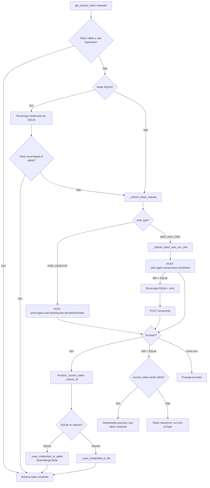

```mermaid
flowchart TD
    A[get_access_token chamado] --> B{Token válido e não expirando?}
    B -->|Sim| C[Retorna token existente]
    B -->|Não| D{Modo SQLite?}

    D -->|Sim| E[Recarrega credenciais do SQLite]
    E --> F{Token recarregado é válido?}
    F -->|Sim| C
    F -->|Não| G[_refresh_token_request]

    D -->|Não| G

    G --> H{auth_type?}
    H -->|KIRO_DESKTOP| I[POST prod.region.auth.desktop.kiro.dev/refreshToken]
    H -->|AWS_SSO_OIDC| J[_refresh_token_aws_sso_oidc]

    J --> J1[POST oidc.region.amazonaws.com/token]
    J1 -->|400 + SQLite| J2[Recarrega SQLite + retry]
    J2 --> J3[POST novamente]

    I --> K{Sucesso?}
    J1 --> K
    J3 --> K

    K -->|Sim| L[Atualiza _access_token, _expires_at]
    L --> M{SQLite ou arquivo?}
    M -->|SQLite| N[_save_credentials_to_sqlite: Read-Merge-Write]
    M -->|Arquivo| O[_save_credentials_to_file]
    N --> C
    O --> C

    K -->|400 + SQLite| P{access_token ainda válido?}
    P -->|Sim| Q[Degradação graciosa: usa token existente]
    P -->|Não| R[Raise ValueError: run kiro-cli login]

    K -->|Outro erro| S[Propaga exceção]
```
