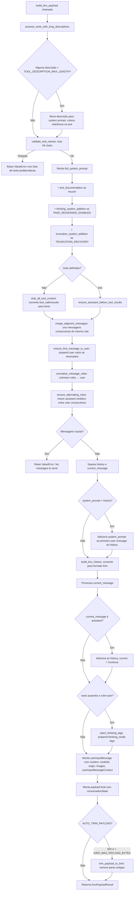

```mermaid
flowchart TD
    A[build_kiro_payload chamado] --> B[process_tools_with_long_descriptions]
    B --> C{Alguma descrição > TOOL_DESCRIPTION_MAX_LENGTH?}
    C -->|Sim| D[Move descrição para system prompt, coloca referência na tool]
    C -->|Não| E

    D --> E[validate_tool_names: max 64 chars]
    E -->|Violação| F[Raise ValueError com lista de tools problemáticas]
    E -->|OK| G[Monta full_system_prompt]

    G --> G1[+ tool_documentation se houver]
    G1 --> G2[+ thinking_system_addition se FAKE_REASONING_ENABLED]
    G2 --> G3[+ truncation_system_addition se TRUNCATION_RECOVERY]

    G3 --> H{tools definidas?}
    H -->|Não| I[strip_all_tool_content: converte tool_calls/results para texto]
    H -->|Sim| J[ensure_assistant_before_tool_results]

    I --> K
    J --> K[merge_adjacent_messages: une mensagens consecutivas do mesmo role]
    K --> L[ensure_first_message_is_user: prepend user vazio se necessário]
    L --> M[normalize_message_roles: unknown roles → user]
    M --> N[ensure_alternating_roles: insere assistant sintético entre user consecutivos]

    N --> O{Mensagens vazias?}
    O -->|Sim| P[Raise ValueError: No messages to send]
    O -->|Não| Q[Separa history e current_message]

    Q --> R{system_prompt + history?}
    R -->|Sim| S[Adiciona system_prompt ao primeiro user message do history]
    R -->|Não| T

    S --> T[build_kiro_history: converte para formato Kiro]
    T --> U[Processa current_message]

    U --> V{current_message é assistant?}
    V -->|Sim| W[Adiciona ao history, current = Continue]
    V -->|Não| X

    W --> X{tools ausentes e role=user?}
    X -->|Sim| Y[inject_thinking_tags: prepend thinking_mode tags]
    X -->|Não| Z

    Y --> Z[Monta userInputMessage com content, modelId, origin, images, userInputMessageContext]
    Z --> AA[Monta payload final com conversationState]

    AA --> AB{AUTO_TRIM_PAYLOAD?}
    AB -->|Sim e > KIRO_MAX_PAYLOAD_BYTES| AC[trim_payload_to_limit: remove pares antigos]
    AB -->|Não| AD[Retorna KiroPayloadResult]
    AC --> AD
```
