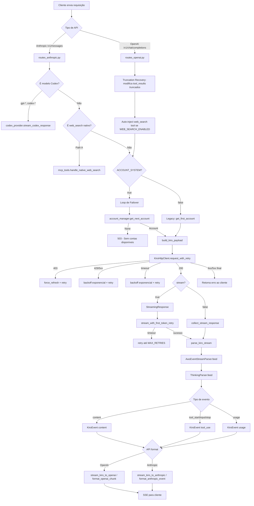

```mermaid
flowchart TD
    A[Cliente envia requisição] --> B{Tipo de API}
    B -->|OpenAI /v1/chat/completions| C[routes_openai.py]
    B -->|Anthropic /v1/messages| D[routes_anthropic.py]

    D --> D1{É modelo Codex?}
    D1 -->|gpt-*, codex-*| D2[codex_provider.stream_codex_response]
    D1 -->|Não| D3{É web_search nativo?}
    D3 -->|Path A| D4[mcp_tools.handle_native_web_search]
    D3 -->|Não| E

    C --> C1[Truncation Recovery: modifica tool_results truncados]
    C1 --> C2[Auto-inject web_search tool se WEB_SEARCH_ENABLED]
    C2 --> E

    E{ACCOUNT_SYSTEM?}
    E -->|true| F[Loop de Failover]
    E -->|false| G[Legacy: get_first_account]

    F --> F1[account_manager.get_next_account]
    F1 -->|None| F2[503 - Sem contas disponíveis]
    F1 -->|Account| F3[build_kiro_payload]

    G --> F3

    F3 --> H[KiroHttpClient.request_with_retry]
    H -->|403| H1[force_refresh + retry]
    H -->|429/5xx| H2[backoff exponencial + retry]
    H -->|timeout| H3[backoff exponencial + retry]
    H -->|200| I{stream?}
    H -->|4xx/5xx final| J[Retorna erro ao cliente]

    I -->|true| K[StreamingResponse]
    I -->|false| L[collect_stream_response]

    K --> M[stream_with_first_token_retry]
    M -->|timeout| M1[retry até MAX_RETRIES]
    M -->|sucesso| N[parse_kiro_stream]

    L --> N

    N --> O[AwsEventStreamParser.feed]
    O --> P[ThinkingParser.feed]
    P --> Q{Tipo de evento}
    Q -->|content| R[KiroEvent content]
    Q -->|tool_start/input/stop| S[KiroEvent tool_use]
    Q -->|usage| T[KiroEvent usage]

    R --> U{API format}
    S --> U
    T --> U
    U -->|OpenAI| V[stream_kiro_to_openai / format_openai_chunk]
    U -->|Anthropic| W[stream_kiro_to_anthropic / format_anthropic_event]

    V --> X[SSE para cliente]
    W --> X
```
