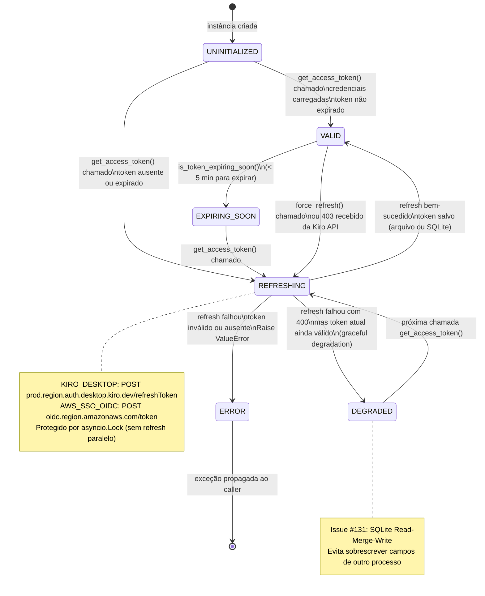
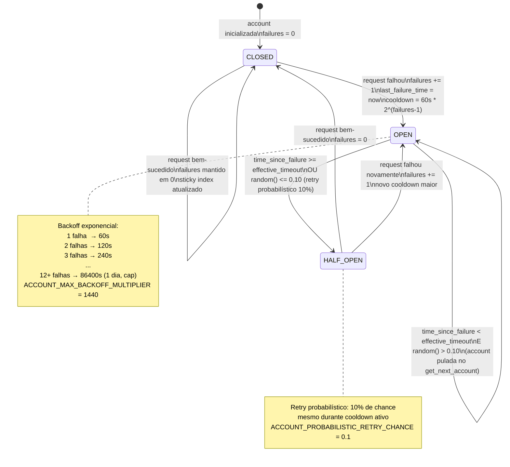
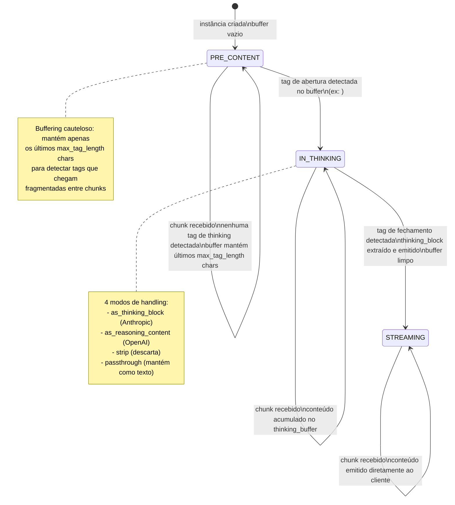
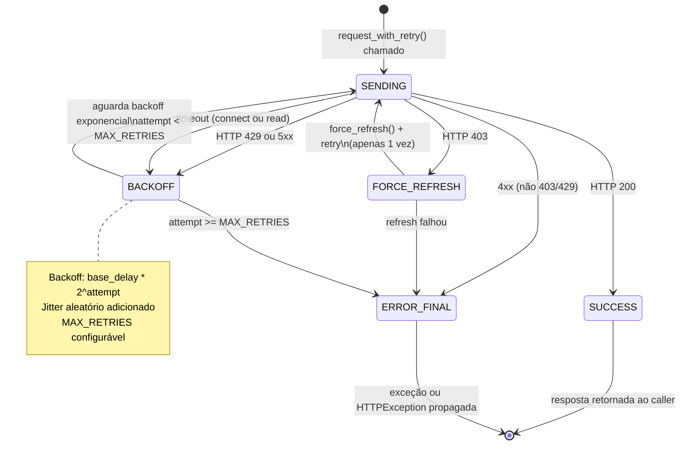
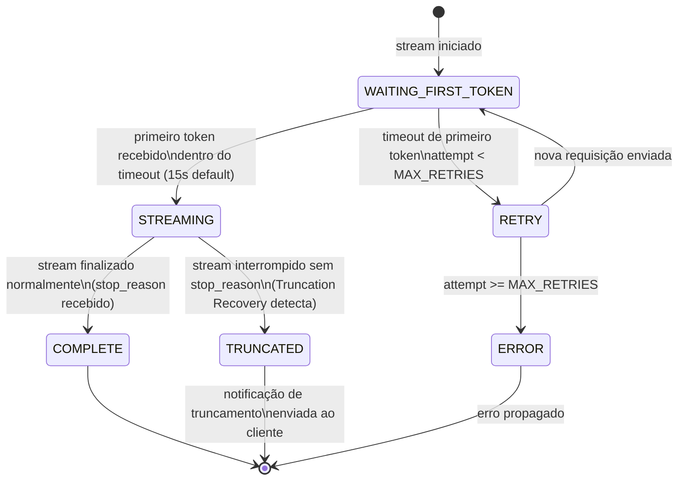
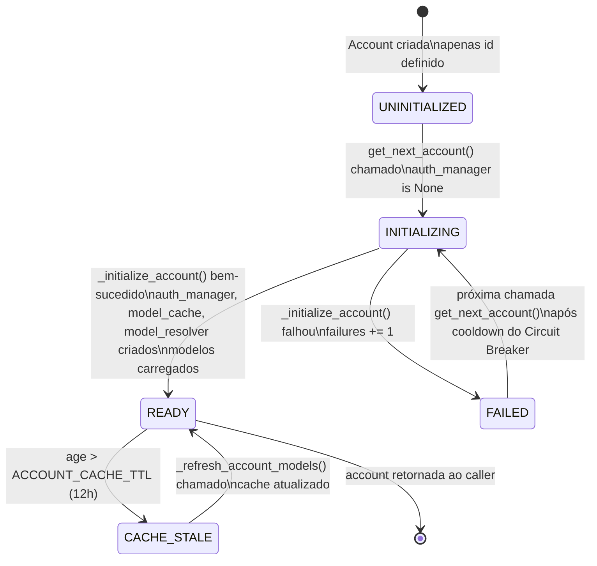

# Máquinas de Estado — Kiro Gateway

> Escala de confiança: 🟢 CONFIRMADO | 🟡 INFERIDO | 🔴 LACUNA

---

## 1. Ciclo de Vida do Access Token (`KiroAuthManager`)

### Transições de Estado do Token

| Estado | Condição de Entrada | Ação | Próximo Estado |
|--------|--------------------|----|----------------|
| UNINITIALIZED | Instância criada | Carrega credenciais do source configurado | VALID ou REFRESHING |
| VALID | Token presente e `expires_at > now + 5min` | Retorna token | VALID |
| EXPIRING_SOON | `expires_at - now < 5min` | Inicia refresh proativo | REFRESHING |
| REFRESHING | Token ausente, expirado ou force_refresh | POST ao endpoint de auth | VALID / DEGRADED / ERROR |
| DEGRADED | Refresh 400 + token ainda válido | Usa token existente, loga warning | VALID (próxima chamada) |
| ERROR | Refresh falhou + token inválido | Raise ValueError com instrução de login | — |

---

## 2. Circuit Breaker de Account (`AccountManager`)

### Regra Especial: Single Account

🟢 Com apenas uma account configurada, o Circuit Breaker é **completamente ignorado**. A account é sempre retornada independente do número de falhas. Razão: o usuário deve ver os erros reais da Kiro API, não mensagens de "sem contas disponíveis".

### Parâmetros Configuráveis

| Parâmetro | Env Var | Default | Descrição |
|-----------|---------|---------|-----------|
| Base timeout | `ACCOUNT_RECOVERY_TIMEOUT` | 60s | Cooldown base para 1 falha |
| Cap multiplicador | `ACCOUNT_MAX_BACKOFF_MULTIPLIER` | 1440 | Cap = 60s × 1440 = 1 dia |
| Retry probabilístico | `ACCOUNT_PROBABILISTIC_RETRY_CHANCE` | 0.10 | 10% de chance de retry em OPEN |
| TTL cache modelos | `ACCOUNT_CACHE_TTL` | 43200s (12h) | Refresca lista de modelos |
| Intervalo save state | `STATE_SAVE_INTERVAL_SECONDS` | 10s | Persistência periódica em state.json |

---

## 3. ThinkingParser FSM (`thinking_parser.py`)

### Estados do ThinkingParser

| Estado | Descrição | Transição de Saída |
|--------|-----------|-------------------|
| PRE_CONTENT | Aguardando início do conteúdo ou tag de thinking | Tag abertura detectada → IN_THINKING; conteúdo normal → STREAMING |
| IN_THINKING | Acumulando conteúdo do bloco de thinking | Tag fechamento detectada → STREAMING |
| STREAMING | Emitindo conteúdo diretamente | Estado terminal (por requisição) |

---

## 4. Ciclo de Vida de Requisição HTTP (`KiroHttpClient`)

---

## 5. Ciclo de Vida de Streaming com First Token Retry

---

## 6. Inicialização Lazy de Account

